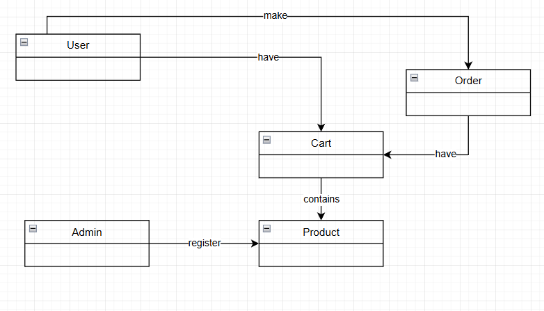
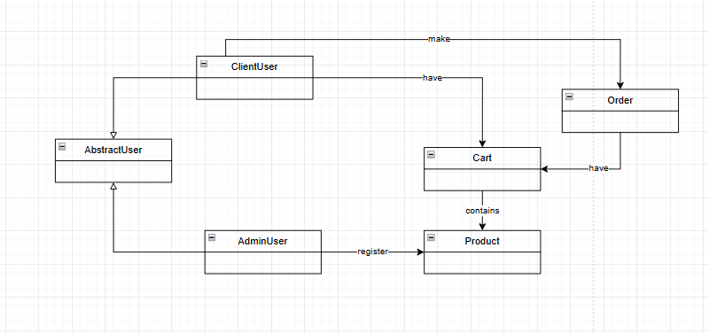
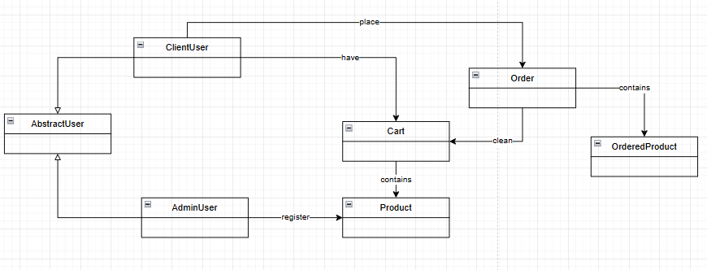

The fist thing that I did was to model the basic entites related to the requirements provided:

* User
* Admin
* Product
* Cart
* Order

Then I noticed that User and Admin where both individuals, and have functionalities in common, so I joined them under the same parent class, then I got:

* AbstractUser
* ClientUser
* AdminUser

In this way, common methods for users can be inserted in the Parent and only the specific behaviours where added to the childrens.

About the ordering process, the details of the order must be saved, and the information about the ordered products have to be saved apart from the original products, to avoid mixing changes in the product with the ordered ones.

